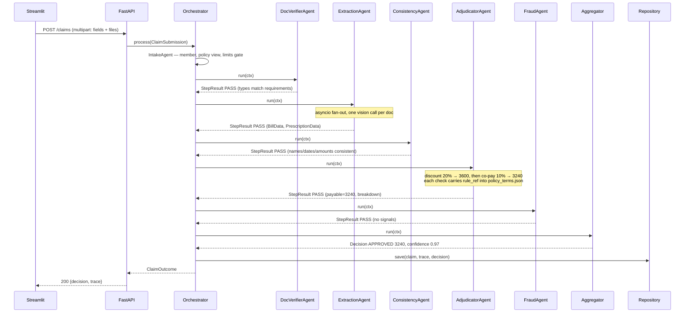
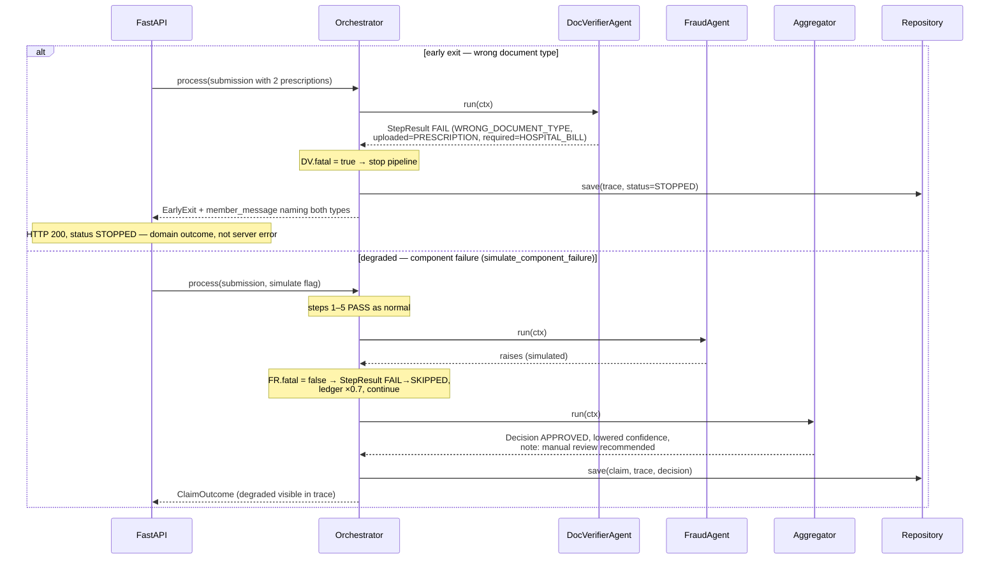
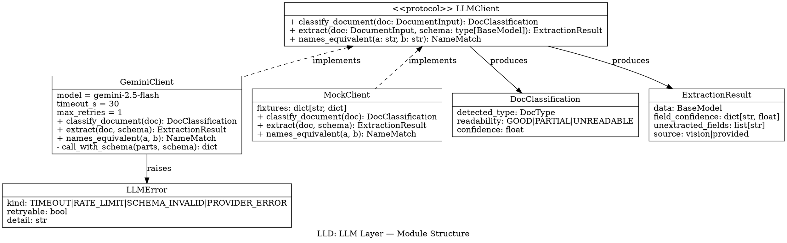
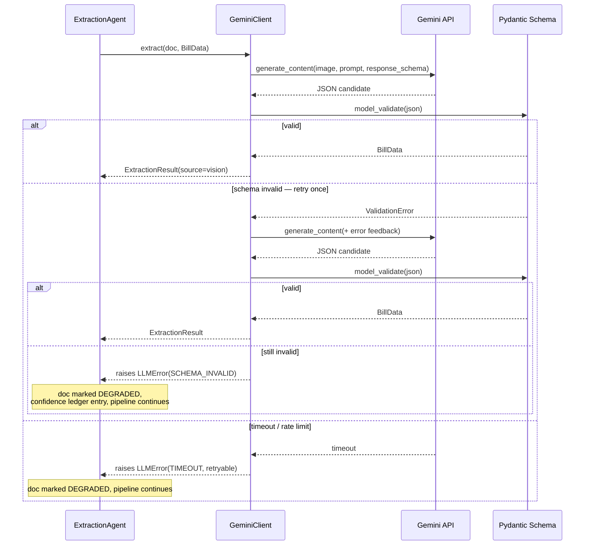
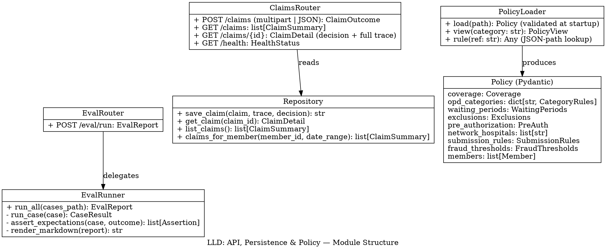

# Health Insurance Claims Processing System — Architecture Diagrams

Generated from: `docs/superpowers/specs/2026-06-12-claims-pipeline-design.md`

---

## High-Level Design

```dot
digraph hld {
    rankdir=LR;
    graph [label="High-Level Design: Claims Processing System", fontsize=14];

    // External actors
    "Member / Ops Reviewer" [shape=ellipse];
    "Plum Evaluator" [shape=ellipse];
    "Gemini API (LLM)" [shape=ellipse];

    subgraph cluster_ui {
        label="UI Service (Render web service #1)";
        style=dashed;
        "Streamlit App\n(Submit / Review / Eval pages)" [shape=box];
    }

    subgraph cluster_api {
        label="API Service (Render web service #2)";
        style=dashed;

        "FastAPI Router\n(/claims, /eval, /health)" [shape=box];
        "Orchestrator" [shape=box];
        "Agent Pipeline\n(7 agents)" [shape=box];
        "LLM Layer\n(LLMClient: Gemini | Mock)" [shape=box];
        "Eval Runner" [shape=box];
        "Policy Loader" [shape=box];
        "Repository" [shape=box];
        "SQLite\n(claims, decisions, traces)" [shape=cylinder];
        "policy_terms.json /\ntest_cases.json" [shape=note];
    }

    "Member / Ops Reviewer" -> "Streamlit App\n(Submit / Review / Eval pages)" [label="HTTPS"];
    "Plum Evaluator" -> "FastAPI Router\n(/claims, /eval, /health)" [label="HTTPS/JSON"];
    "Streamlit App\n(Submit / Review / Eval pages)" -> "FastAPI Router\n(/claims, /eval, /health)" [label="REST/JSON\n(multipart for files)"];
    "FastAPI Router\n(/claims, /eval, /health)" -> "Orchestrator" [label="ClaimSubmission"];
    "FastAPI Router\n(/claims, /eval, /health)" -> "Eval Runner" [label="run request"];
    "Eval Runner" -> "Orchestrator" [label="ClaimSubmission\n(per test case)"];
    "Orchestrator" -> "Agent Pipeline\n(7 agents)" [label="ClaimContext"];
    "Agent Pipeline\n(7 agents)" -> "LLM Layer\n(LLMClient: Gemini | Mock)" [label="DocumentInput /\nname pairs"];
    "LLM Layer\n(LLMClient: Gemini | Mock)" -> "Gemini API (LLM)" [label="HTTPS\n(JSON-schema mode)"];
    "Agent Pipeline\n(7 agents)" -> "Policy Loader" [label="rule lookups\n(JSON paths)"];
    "Policy Loader" -> "policy_terms.json /\ntest_cases.json" [label="file read\n(startup)"];
    "Orchestrator" -> "Repository" [label="ClaimTrace + Decision"];
    "Repository" -> "SQLite\n(claims, decisions, traces)" [label="SQL"];
}
```



**Deployment & tech specs (per HLD node):**

| Component | Tech | Notes |
|---|---|---|
| Streamlit App | Python 3.12, Streamlit, httpx | Thin client; only talks HTTP to API (`API_BASE_URL` env). Never imports pipeline code. |
| FastAPI Router | FastAPI + Uvicorn, async handlers | `POST /claims`, `GET /claims`, `GET /claims/{id}`, `POST /eval/run`, `GET /health` |
| Orchestrator | Pure Python (async) | Deterministic fixed order, early exits, owns trace + confidence ledger |
| Agent Pipeline | Pure Python + Pydantic v2 | 7 agents; LLM used only in DocVerifier, Extraction, Consistency |
| LLM Layer | `google-genai` SDK, `gemini-2.5-flash` | JSON-schema response mode, 30s timeout, 1 retry; `MockClient` via `LLM_PROVIDER` env |
| Policy Loader | Pydantic v2 validation at startup | Single source of all rules; agents reference rules by JSON path (`rule_ref`) |
| Repository | stdlib `sqlite3` | JSON columns for trace/decision; indexes on claim_id, member_id, date |
| Eval Runner | Python module + CLI (`python -m app.eval`) | Injects test-case content post-extraction; emits `docs/eval_report.md` |
| Deploy | Render free tier ×2 via `render.yaml` | Env: `GEMINI_API_KEY`, `LLM_PROVIDER`, `API_BASE_URL` |

---

## Low-Level Design

### Subsystem 1: Orchestrator & Agent Pipeline

```dot
digraph lld_pipeline {
    graph [label="LLD: Orchestrator & Agent Pipeline — Module Structure", fontsize=14];
    rankdir=TB;

    "Orchestrator" [shape=record, label="{Orchestrator|+ process(submission: ClaimSubmission): ClaimOutcome\l- run_step(agent: Agent, ctx: ClaimContext): StepResult\l- handle_failure(agent: Agent, err: AgentError): EarlyExit \| Degrade\l}"];

    "Agent (Protocol)" [shape=record, label="{\<\<protocol\>\> Agent|name: str\lfatal: bool\l+ run(ctx: ClaimContext): StepResult\l}"];

    "IntakeAgent" [shape=record, label="{IntakeAgent|fatal = true\l+ run(ctx): StepResult\l- resolve_member(member_id): Member\l- build_policy_view(category): PolicyView\l}"];
    "DocVerifierAgent" [shape=record, label="{DocVerifierAgent|fatal = true\l+ run(ctx): StepResult\l- classify(doc: DocumentInput): DocVerdict\l- check_requirements(verdicts, required): RequirementsDiff\l- build_member_message(diff): str\l}"];
    "ExtractionAgent" [shape=record, label="{ExtractionAgent|fatal = false\l+ run(ctx): StepResult\l- extract_one(doc): ExtractionResult  (async fan-out)\l- schema_for(doc_type): type[BaseModel]\l}"];
    "ConsistencyAgent" [shape=record, label="{ConsistencyAgent|fatal = patient_mismatch only\l+ run(ctx): StepResult\l- check_patients(extractions, member): ConsistencyFinding\l- check_dates(extractions, claim): ConsistencyFinding\l- check_amounts(extractions, claim): ConsistencyFinding\l}"];
    "AdjudicatorAgent" [shape=record, label="{AdjudicatorAgent  (PURE CODE)|fatal = true (internal error only)\l+ run(ctx): StepResult\l- check_exclusions(): PolicyCheck\l- check_waiting_periods(): PolicyCheck\l- check_pre_auth(): PolicyCheck\l- check_limits(): PolicyCheck\l- adjudicate_line_items(): list[LineItemVerdict]\l- compute_payable(verdicts): FinancialBreakdown\l}"];
    "FraudAgent" [shape=record, label="{FraudAgent|fatal = false\l+ run(ctx): StepResult\l- same_day_count(history): FraudSignal\l- monthly_count(history): FraudSignal\l- high_value(claim): FraudSignal\l}"];
    "Aggregator" [shape=record, label="{Aggregator|fatal = true (internal error only)\l+ run(ctx): StepResult\l- derive_status(trace): DecisionStatus\l- compose_messages(trace): (member_message, ops_summary)\l}"];

    "ClaimContext" [shape=record, label="{ClaimContext|submission: ClaimSubmission\lclaim: Claim?\lmember: Member?\lpolicy_view: PolicyView?\ldoc_verdicts: list[DocVerdict]\lextractions: list[ExtractionResult]\lfindings: list[ConsistencyFinding]\lline_verdicts: list[LineItemVerdict]\lfraud_signals: list[FraudSignal]\ltrace: ClaimTrace\l}"];

    "StepResult" [shape=record, label="{StepResult|step: str\lstatus: PASS\|FAIL\|DEGRADED\|SKIPPED\lchecks: list[PolicyCheck]\lconfidence_entries: list[ConfidenceEntry]\lerror: AgentError?\lduration_ms: int\l}"];

    "ClaimTrace" [shape=record, label="{ClaimTrace|claim_id: str\lpipeline_version: str\lsteps: list[StepResult]\lconfidence_ledger: list[ConfidenceEntry]\ldecision: Decision?\l+ append(result: StepResult): void\l+ confidence(): float\l}"];

    "Decision" [shape=record, label="{Decision|status: APPROVED\|PARTIAL\|REJECTED\|MANUAL_REVIEW\lapproved_amount: int\lreasons: list[str]\lconfidence: float\lmember_message: str\lops_summary: str\l}"];

    "Agent (Protocol)" -> "IntakeAgent" [label="implements", style=dashed, dir=back];
    "Agent (Protocol)" -> "DocVerifierAgent" [label="implements", style=dashed, dir=back];
    "Agent (Protocol)" -> "ExtractionAgent" [label="implements", style=dashed, dir=back];
    "Agent (Protocol)" -> "ConsistencyAgent" [label="implements", style=dashed, dir=back];
    "Agent (Protocol)" -> "AdjudicatorAgent" [label="implements", style=dashed, dir=back];
    "Agent (Protocol)" -> "FraudAgent" [label="implements", style=dashed, dir=back];
    "Agent (Protocol)" -> "Aggregator" [label="implements", style=dashed, dir=back];

    "Orchestrator" -> "Agent (Protocol)" [label="runs in fixed order"];
    "Orchestrator" -> "ClaimContext" [label="owns"];
    "Agent (Protocol)" -> "StepResult" [label="produces"];
    "ClaimContext" -> "ClaimTrace" [label="holds"];
    "ClaimTrace" -> "StepResult" [label="appends"];
    "Aggregator" -> "Decision" [label="produces"];
}
```



**Sequence — happy path with network discount (TC010 shape):**



**Sequence — early exit on wrong document (TC001 shape) and degraded run (TC011 shape):**



---

### Subsystem 2: LLM Layer



**Sequence — extraction with validation retry and degrade path:**



---

### Subsystem 3: API, Persistence & Policy



**Sequence — eval run (deliverable #4 generation):**

```mermaid
sequenceDiagram
    participant CLI as CLI / POST /eval/run
    participant ER as EvalRunner
    participant ORC as Orchestrator
    participant FS as docs/eval_report.md

    CLI->>ER: run_all(test_cases.json)
    loop 12 test cases
        ER->>ORC: process(submission from case input)
        Note over ORC: document content injected post-extraction<br/>(source=provided); simulate flag honored
        ORC-->>ER: ClaimOutcome (decision + trace)
        ER->>ER: assert_expectations(case, outcome)
    end
    ER->>FS: render_markdown(full decisions, traces, pass/fail, mismatch explanations)
    ER-->>CLI: EvalReport (12 case results)
```

---

## Notes

- Node and method names above are implementation contracts — code uses these names verbatim.
- Streamlit UI has no LLD: it is a thin HTTP client with three pages and no domain logic.
- Render `.dot` blocks with Graphviz (`dot -Tpng`) and Mermaid blocks with any Mermaid renderer; both render natively on GitHub.
